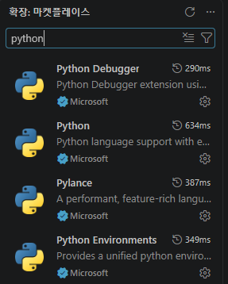
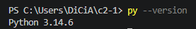
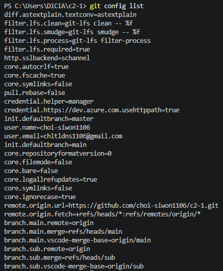
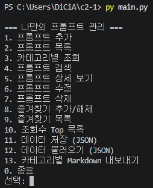
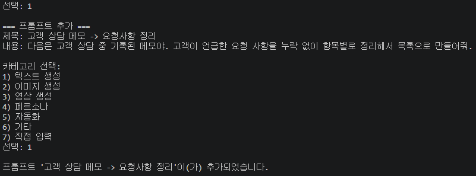
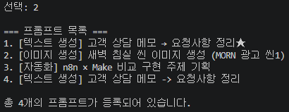
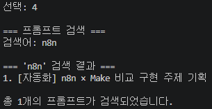
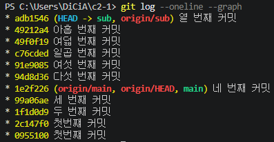

# 나만의 프롬프트 관리 프로그램

GenAI 미션을 수행하며 쌓인 프롬프트를 체계적으로 관리하기 위한 Python 콘솔 프로그램입니다.
텍스트 생성, 이미지 생성, 자동화 등 다양한 카테고리의 프롬프트를 추가·검색·수정하고,
자주 쓰는 항목은 즐겨찾기로 관리하며, JSON 저장 및 Markdown 내보내기까지 지원합니다.

## 실행 방법

Python 3.10 이상이 필요합니다. 외부 라이브러리 설치 없이 표준 라이브러리만으로 동작합니다.

```bash
python main.py
```

실행하면 메뉴가 출력되고, 번호를 입력해 원하는 기능을 선택합니다.
각 기능이 끝나면 다시 메뉴로 돌아오며, `0`을 입력하면 프로그램이 종료됩니다.

## 기능 목록

| 번호 | 기능 | 설명 |
|------|------|------|
| 1 | 프롬프트 추가 | 제목·내용·카테고리를 입력해 새 프롬프트를 등록합니다. 빈 값은 다시 입력을 요청합니다. |
| 2 | 프롬프트 목록 | 등록된 모든 프롬프트를 번호·카테고리·즐겨찾기 여부와 함께 출력합니다. |
| 3 | 카테고리별 조회 | 카테고리를 선택해 해당 카테고리의 프롬프트만 모아 봅니다. |
| 4 | 프롬프트 검색 | 키워드가 제목 또는 내용에 포함된 프롬프트를 검색합니다. |
| 5 | 프롬프트 상세 보기 | 선택한 프롬프트의 전체 내용을 표시하며, 조회할 때마다 조회수가 올라갑니다. |
| 6 | 프롬프트 수정 | 선택한 프롬프트의 제목·내용·카테고리를 수정합니다. (Enter 시 기존 값 유지) |
| 7 | 프롬프트 삭제 | 선택한 프롬프트를 확인 절차를 거쳐 삭제합니다. |
| 8 | 즐겨찾기 추가/해제 | 선택한 프롬프트의 즐겨찾기 상태를 토글합니다. |
| 9 | 즐겨찾기 목록 | 즐겨찾기한 프롬프트만 모아 봅니다. |
| 10 | 조회수 Top 목록 | 조회수가 높은 순으로 정렬해 보여줍니다. |
| 11 | 데이터 저장 (JSON) | 현재 프롬프트를 JSON 파일로 저장합니다. |
| 12 | 데이터 불러오기 (JSON) | JSON 파일에서 프롬프트를 불러옵니다. |
| 13 | 카테고리별 Markdown 내보내기 | 카테고리별로 나눠 `export` 폴더에 `.md` 파일로 내보냅니다. |
| 0 | 종료 | 프로그램을 종료합니다. |

## 프롬프트 데이터 구조

프롬프트는 리스트 안에 딕셔너리 형태로 저장되며, 각 프롬프트는 다음 항목을 가집니다.

```python
{
    "title": "프롬프트 제목",
    "content": "프롬프트 내용",
    "category": "카테고리",
    "favorite": False,   # 즐겨찾기 여부
    "views": 0           # 조회수
}
```

프로그램 실행 중에 추가·수정·즐겨찾기한 내용은 유지되지만,
JSON으로 저장하지 않고 종료하면 초기 상태로 돌아갑니다.

## 카테고리

프롬프트는 아래 6가지 카테고리로 분류합니다.

- **텍스트 생성** — 블로그·이메일·요약 등 텍스트 결과물을 만드는 지시문
- **이미지 생성** — 이미지 생성 AI에 입력하는 키워드·묘사 프롬프트
- **영상 생성** — 이미지→영상 변환 등 영상 생성용 프롬프트
- **페르소나** — 특정 역할·전문가 배역을 부여하는 프롬프트
- **자동화** — 노코드 자동화 워크플로우 기획·설계 관련 프롬프트
- **기타** — 위 분류에 속하지 않는 프롬프트

프로그램 시작 시 이전 미션에서 작성한 프롬프트 3개(텍스트 생성 / 이미지 생성 / 자동화)가 기본 데이터로 등록되어 있습니다.

## 개발 환경

- Python 3.10 이상
- 외부 라이브러리 없음 (표준 라이브러리 `json`, `os`만 사용)

## 코드 구조

기능별로 함수를 분리해 작성했습니다.

- `show_menu()` — 메뉴 출력
- `add_prompt()` — 프롬프트 추가
- `show_list()` — 전체 목록 출력
- `search_by_category()` — 카테고리별 조회
- `search_prompt()` — 키워드 검색
- `detail_prompt()` — 상세 보기 (조회수 증가)
- `update_prompt()` — 수정
- `delete_prompt()` — 삭제
- `manage_favorite()` — 즐겨찾기 토글
- `show_favorite_list()` — 즐겨찾기 목록
- `show_top_viewed()` — 조회수 Top 목록
- `save_to_json()` / `load_from_json()` — JSON 저장·불러오기
- `export_to_markdown()` — 카테고리별 Markdown 내보내기
- `main()` — 메뉴 루프 및 기능 분기

## 제출 자료 (스크린샷)

### 개발 환경 설정

VSCode, Python 버전, Git 설정 화면입니다.

- VSCode 및 Python 확장


- Python 버전 확인


- Git 사용자 정보 및 기본 브랜치 설정



### 프로그램 실행 결과

메뉴 화면, 프롬프트 추가, 목록, 검색 등 주요 기능의 실행 결과입니다.

- 메뉴 화면


- 프롬프트 추가


- 프롬프트 목록


- 프롬프트 검색


### Git 커밋 그래프

`git log --oneline --graph` 실행 결과입니다.

